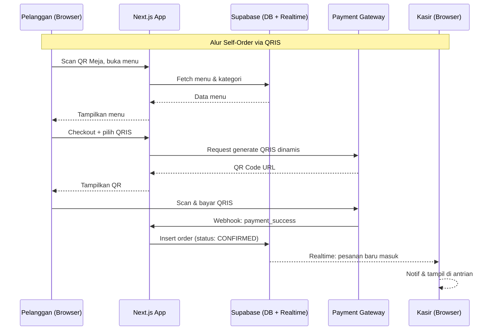
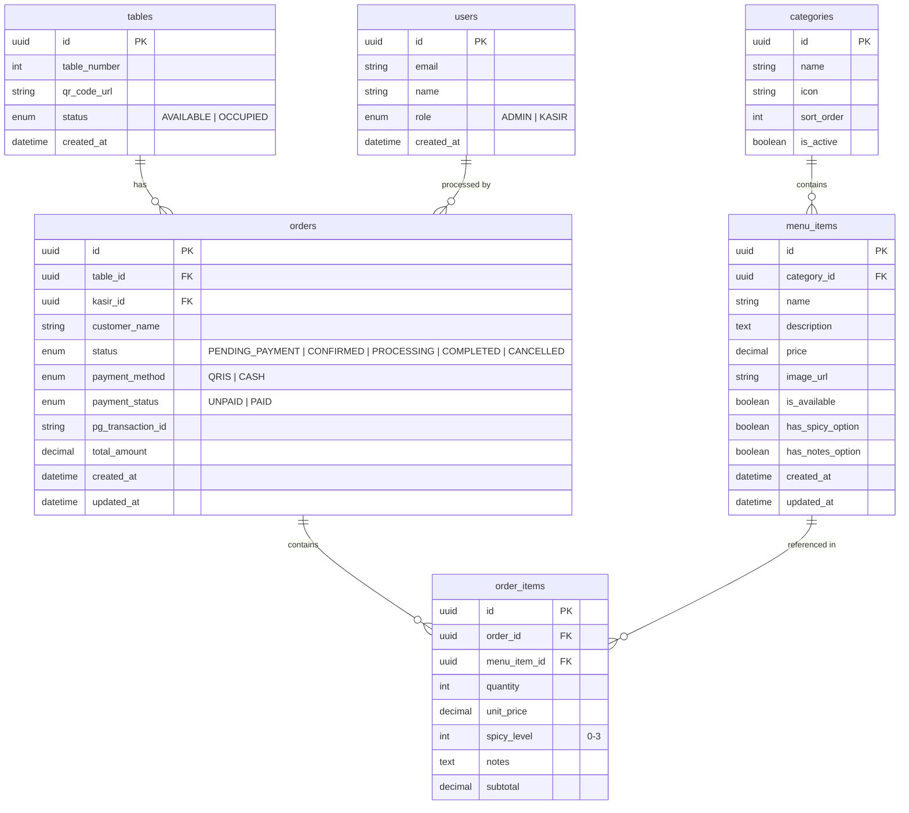

# PRD — BurserOrder: Self-Order & POS System for Burjo

## 1. Overview

**BurserOrder** adalah sistem digital terintegrasi untuk Burjo (Warmindo) di Semarang yang bertujuan menggantikan proses pemesanan manual menjadi sistem digital end-to-end. Sistem mencakup tiga surface utama:

1. **Self-Order (Pelanggan)** — Pelanggan scan QR di meja, pilih menu, kustomisasi, checkout, lalu bayar QRIS atau cash.
2. **POS Kasir** — Kasir menerima pesanan masuk secara realtime, memproses pembayaran cash, dan mengelola status pesanan.
3. **Dashboard Admin/Owner** — Owner mengelola menu, melihat laporan penjualan, dan memantau performa bisnis.

Masalah utama yang diselesaikan: pencatatan pesanan manual yang lambat, rawan human error, dan tidak ada visibilitas data penjualan untuk owner.

---

## 2. Requirements

| # | Requirement | Prioritas |
|---|-------------|-----------|
| R1 | Sistem dapat diakses via Web Browser (mobile & desktop) | Wajib |
| R2 | Pelanggan tidak perlu login/registrasi untuk memesan | Wajib |
| R3 | Kasir login menggunakan akun yang dibuat oleh Admin | Wajib |
| R4 | Owner/Admin memiliki akses penuh ke semua fitur dashboard | Wajib |
| R5 | Notifikasi pesanan masuk ke kasir secara realtime | Wajib |
| R6 | Mendukung pembayaran QRIS (via PG yang disediakan developer) dan Cash | Wajib |
| R7 | Konfirmasi pembayaran QRIS otomatis via webhook dari Payment Gateway | Wajib |
| R8 | Pelanggan dapat mengkustomisasi item (catatan, level pedas, dll) | Wajib |
| R9 | Sistem berjalan lokal terlebih dahulu (no cloud deployment di MVP) | Wajib |
| R10 | Supabase digunakan sebagai backend database, auth, dan realtime | Wajib |

---

## 3. Core Features

### 3.1 Self-Order App (Pelanggan)
- Scan QR unik per meja → sesi terikat ke nomor meja
- Tampil menu berdasarkan kategori (mie, nasi, minuman, snack, dll)
- **Kustomisasi item:** catatan bebas, pilih level pedas, pilih variasi porsi
- Keranjang belanja dengan ringkasan harga
- Checkout: pilih metode bayar (QRIS / Cash)
  - **QRIS:** sistem generate QR unik → webhook PG konfirmasi otomatis → status pesanan berubah `PAID`
  - **Cash:** pesanan langsung masuk ke kasir dengan status `PENDING_PAYMENT`, kasir yang konfirmasi
- Halaman tracking status pesanan sederhana (Pesanan Diterima → Diproses → Selesai)

### 3.2 POS Kasir
- Dashboard pesanan masuk realtime (menggunakan Supabase Realtime subscription)
- Antrian pesanan: tampilkan nomor meja, item, kustomisasi, total harga
- Aksi: konfirmasi pembayaran Cash, tandai pesanan selesai, batalkan pesanan
- Input pesanan manual (untuk pelanggan yang memesan langsung ke kasir)
- Riwayat transaksi hari ini

### 3.3 Dashboard Owner/Admin
- **Manajemen Menu:** Tambah / Edit / Hapus item menu, kategori, harga, foto, status tersedia/habis
- **Manajemen Meja:** Setup jumlah meja & generate QR code per meja
- **Laporan Penjualan:** Ringkasan harian/mingguan/bulanan (total transaksi, total revenue, item terlaris)
- **Manajemen User:** Tambah/hapus akun kasir
- **Pengaturan Sistem:** Jam operasional, nama toko, logo

---

## 4. User Flow

### 4.1 Alur Pelanggan (Self-Order)
```
Scan QR Meja
    ↓
Lihat menu & kategori
    ↓
Pilih item → Kustomisasi (level pedas, catatan, porsi) → Tambah ke keranjang
    ↓
Review keranjang → Checkout
    ↓
Pilih metode bayar
    ├── QRIS: Tampil QR dinamis → Scan & bayar → Webhook konfirmasi → Pesanan dikirim ke dapur
    └── Cash: Pesanan masuk ke kasir (status: Menunggu Pembayaran) → Kasir konfirmasi cash → Pesanan ke dapur
    ↓
Halaman status pesanan (realtime update)
```

### 4.2 Alur Kasir (POS)
```
Login Kasir
    ↓
Lihat daftar pesanan masuk (realtime)
    ↓
Untuk pesanan Cash: Konfirmasi pembayaran diterima
    ↓
Update status pesanan (Diproses → Selesai)
    ↓
Bisa input pesanan manual jika pelanggan order langsung
```

### 4.3 Alur Admin/Owner
```
Login Admin
    ↓
Dashboard: ringkasan penjualan hari ini
    ↓
Manajemen menu → Edit harga/ketersediaan
    ↓
Laporan → Filter periode → Export (optional)
    ↓
Manajemen meja → Generate/print QR code
```

---

## 5. Architecture

### Stack Keseluruhan

| Layer | Teknologi |
|-------|-----------|
| Frontend | Next.js 15 (App Router) |
| UI Components | Shadcn/ui + Tailwind CSS |
| ORM | Prisma |
| Database | Supabase (PostgreSQL) |
| Auth | Supabase Auth |
| Realtime | Supabase Realtime |
| Payment | QRIS via Payment Gateway (PG custom developer) |
| Hosting | Lokal (dev server) |

### Diagram Alur Sistem



---

## 6. Database Schema



| Tabel | Deskripsi |
|-------|-----------|
| **users** | Akun kasir dan admin, auth via Supabase Auth |
| **tables** | Data meja beserta QR code unik per meja |
| **categories** | Kategori menu (mie, minuman, snack, dll) |
| **menu_items** | Master data menu dengan opsi kustomisasi |
| **orders** | Transaksi pesanan, terhubung ke meja dan kasir |
| **order_items** | Detail per item dalam satu pesanan + kustomisasi |

---

## 7. Design & Technical Constraints

### 7.1 Design System
- **Mode:** Light mode sebagai default
- **Color Palette:** Warm, appetite-friendly tones — oranye/kuning sebagai aksen utama
- **Typography:**
  - **Sans (UI):** `Inter, ui-sans-serif, system-ui`
  - **Mono (Kode/Struk):** `JetBrains Mono, monospace`
- **Component Library:** Shadcn/ui (berbasis Radix UI, accessible by default)
- **Responsive:** Mobile-first untuk halaman Self-Order, Desktop-first untuk POS & Dashboard

### 7.2 Technical Constraints
- Next.js App Router dengan Server Components untuk halaman publik (menu)
- Supabase Realtime untuk notifikasi pesanan ke kasir (tidak menggunakan Socket.IO)
- Semua transaksi keuangan harus atomic (gunakan Prisma transactions)
- Webhook payment gateway harus diverifikasi signature-nya
- Tidak ada simpan data kartu / info sensitif di database lokal
- QR code meja di-generate server-side dan bisa dicetak sebagai PDF

### 7.3 Fase Pengembangan

| Fase | Fokus | Deliverable |
|------|-------|-------------|
| **Fase 1** | Setup project & infrastruktur | Next.js + Supabase + Prisma schema + auth |
| **Fase 2** | POS Kasir (core) | Terima pesanan realtime, manajemen status, input manual |
| **Fase 3** | Self-Order App | QR → Menu → Keranjang → Checkout (Cash dulu) |
| **Fase 4** | Integrasi QRIS | Webhook PG, generate QR dinamis, auto-konfirmasi |
| **Fase 5** | Dashboard Admin | Manajemen menu, laporan, manajemen meja & QR |
| **Fase 6** | Polish & Testing | UX polish, edge cases, simulasi multi-meja |
